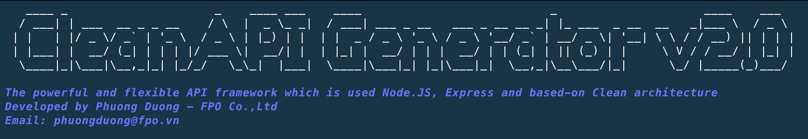

# CleanAPI Generator v2.0



## 1. Description
The powerful and flexible API framework which is used Node.JS, Express and based-on Clean architecture

## 2. Installation
```bash
yarn install
node .
```

## 3. Checklist
#### 3.1. Stage 01
- [x] Build main UI
- [x] Get project and database info
- [x] Generate folder structure
- [x] Generate file `package.json`
- [x] Generate file `README.md`
- [x] Generate file `.gitignore`
- [x] Generate file `server.js`
- [x] Generate files in `utils` folder
- [x] Generate file `config.js`
- [x] Generate Entities files
- [x] Generate Data_provider files
- [x] Generate Use_case files
- [x] Generate Routes files
- [x] Test phrase

#### 3.2. Stage 02
- [ ] Add required and basic constraint into `Entity`
- [x] Upgrade API method (`GET`, `POST`, `PUT`, `PATCH`, `DELETE`)
- [x] Upgrade Middle-ware to check token / non-token API
- [x] Upgrade `utils` libraries (update the latest functions in generator)
- [x] Install some new necessary packages
- [x] Uninstall some unnecessary packages
- [x] Fix some old issues

#### 3.3. Stage 03
- [x] Auto format code with Prettier
- [x] Auto check code style with ESLint
- [x] Only uses `const` and `let`
- [x] Upgrade pagination method
- [x] Change to use `.env` file for configuration
- [x] Change to use `yarn` instead of `npm`

## Author
**Dương Trần Hà Phương (Mr.)** - CEO [FPO Co.,Ltd](https://fpo.vn)
- Email: [phuongduong@fpo.vm](mailto:phuongduong@fpo.vm)
- Website: [https://phuongduong.fpo.vn](https://phuongduong.fpo.vn)
- Gitlab: [@dthphuong1](https://gitlab.com/dthphuong1)
- Github: [@dthphuong](https://github.com/dthphuong)
## License

[MIT](https://choosealicense.com/licenses/mit/)

Copyright © 2019-2021, [Phuong Duong](https://phuongduong.fpo.vn)

Permission to use, copy, modify, and/or distribute this software for any
purpose with or without fee is hereby granted, provided that the above
copyright notice and this permission notice appear in all copies.

THE SOFTWARE IS PROVIDED "AS IS" AND THE AUTHOR DISCLAIMS ALL WARRANTIES WITH
REGARD TO THIS SOFTWARE INCLUDING ALL IMPLIED WARRANTIES OF MERCHANTABILITY
AND FITNESS. IN NO EVENT SHALL THE AUTHOR BE LIABLE FOR ANY SPECIAL, DIRECT,
INDIRECT, OR CONSEQUENTIAL DAMAGES OR ANY DAMAGES WHATSOEVER RESULTING FROM
LOSS OF USE, DATA OR PROFITS, WHETHER IN AN ACTION OF CONTRACT, NEGLIGENCE OR
OTHER TORTIOUS ACTION, ARISING OUT OF OR IN CONNECTION WITH THE USE OR
PERFORMANCE OF THIS SOFTWARE.
